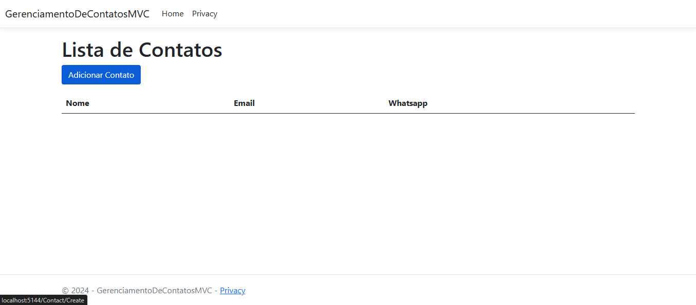
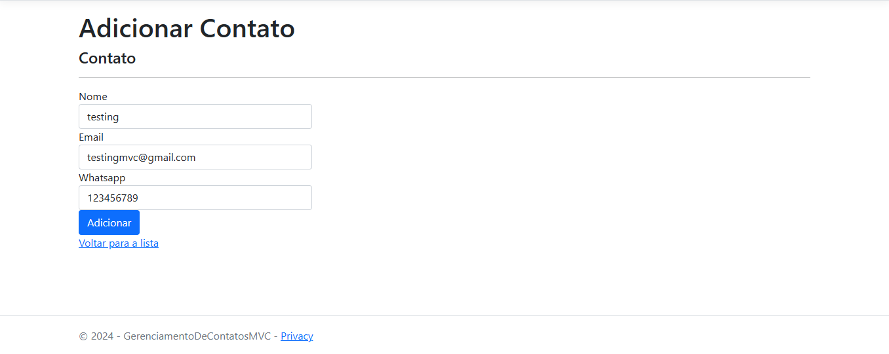
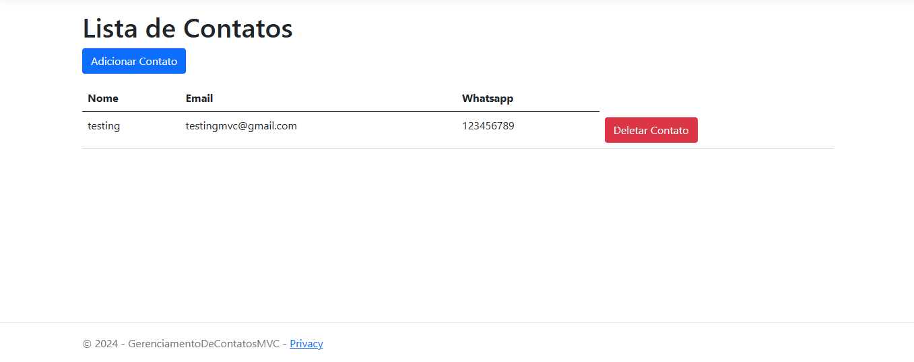

<h1 align="center">
   
  
  
  
 
  Gerenciamento de Contatos | MVC (Model View Controller)
</h1>

[english]
 
This academic project was developed using ASP.NET with the objective of applying and consolidating the concepts learned about the MVC architectural pattern, without worrying about a final product, but focusing on learning and the practical application of the architecture.
MVC (Model-View-Controller) is divided into three layers: the Model, responsible for data logic and business rules; the View, which carries the user interface; and the Controller, which manages communication between the View and the Model. This exercise allowed me to better understand how to separate responsibilities within an application, facilitating code maintenance and scalability, in addition to providing practical experience with the application of MVC in a real development context. 
 
[português]
 
Este projeto acadêmico foi desenvolvido utilizando ASP.NET com o intuito de aplicar e consolidar os conceitos aprendidos sobre o padrão de arquitetura MVC, sem a preocupação de um produto final, mas focando no aprendizado e na aplicação prática da arquitetura.
O MVC (Model-View-Controller) é dividido em três camadas: o Model, responsável pela lógica de dados e regras de negócio; a View, encarregada da interface com o usuário; e o Controller, que gerencia a comunicação entre a View e o Model. Este exercício me permitiu entender melhor como separar as responsabilidades dentro de uma aplicação, facilitando a manutenção e escalabilidade do código, além de proporcionar uma experiência prática com a aplicação do MVC em um contexto real de desenvolvimento.  

---

## 🚀 Tecnologias | Technologies

Esse Projeto foi desenvolvido com a seguintes tecnologias:
This project was developed with the following technologies:

- ✔️ C#, Razor Pages (C# + HTML = .cshtml)

---

Rodrigo Oliveira.
-> [Veja o meu linkedin](https://www.linkedin.com/in/rodrigooliveiradev/)
